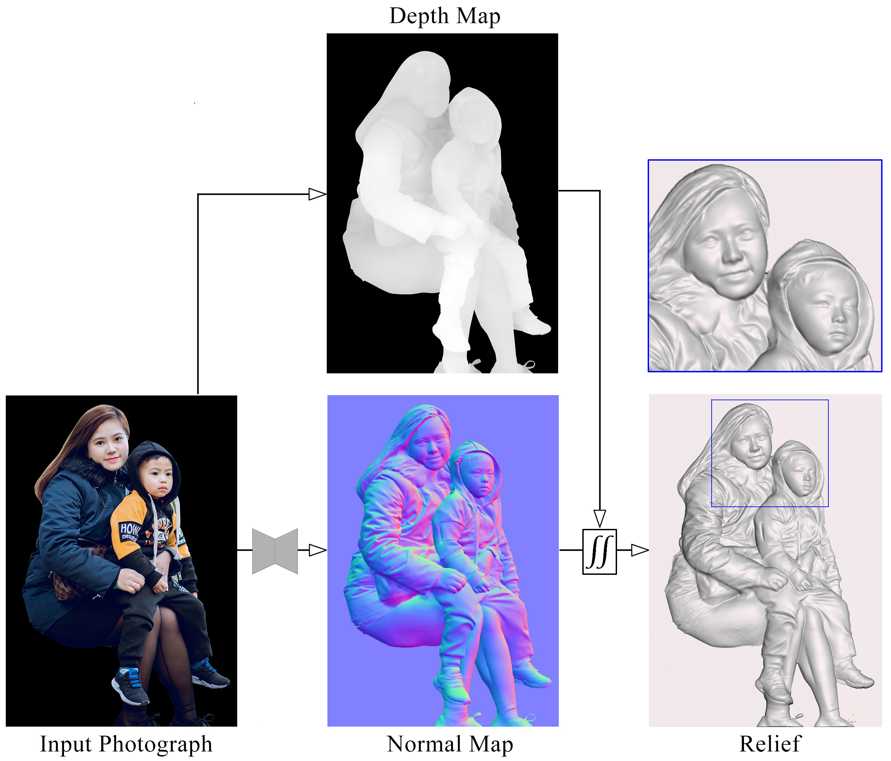
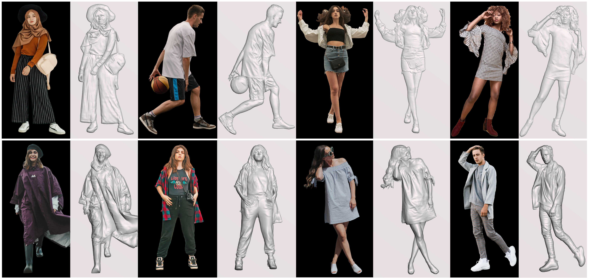

# MMRelief: Modeling Multi-human Relief from a Single Photograph

 
Yu-Wei Zhang, Yanqing Liu, Hongguang Yang, Yanzhao Chen, Hui Liu, Zhongping Ji, Caiming Zhang

<a href = "">Paper</a> |
<a href = "https://pan.baidu.com/s/13hwNrfjbchzRGalTlLZ5lQ?pwd=rg1f">Data(百度网盘)</a> |
<a href = "https://drive.google.com/file/d/1GhFdNuZphg4LK-26Gv75csQ0skHqIAla/view?usp=sharing">Data(Google Drive)</a> |

 

    

**Introduction**: Given an input photograph, MMRelief first estimates an occlusion-aware depth
map and a detailed normal map respectively.
By combining the strengths of both maps through depth-constrained normal integration, MMRelief is able to produce human
reliefs with accurate occlusions, reasonable depth ordering and rich geometrical details.

## MMRelief:

* **Video**:

  

you can download the high-definition video click <a href = "https://github.com/yanqingliu3856/MMRelief/blob/e90f053508b57399c881153d84c56f593a877a2f/video/video.mp4?raw=true">here</a>

* **Single-human results**:

* **Multi-human results**:

    

* **Acknowledgement**: we thank <a href = "https://www.pexels.com">pexels</a> and <a href = "https://unsplash.com">
  unsplash</a>  for providing free testing photographs.
